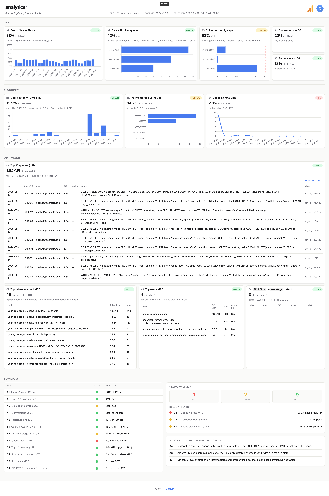

# analytics²

 [](https://developers.google.com/analytics) [](https://cloud.google.com/bigquery)

<p align="left">
  <a href="#quick-start">Quick start</a> •
  <a href="#how-it-works">How it works</a> •
  <a href="#use-it-for-your-org">Use it for your org</a>
</p>

*Analytics for analytics* – a dashboard for teams running GA4 and BigQuery on the free tier. It answers two questions: *how close am I to each free-tier limit?* and *where is my current usage going, so I can action on it?*

## Screenshot



## Sections

Twelve tiles in three sections – the limit trackers tell you *where you stand*, the optimizer tiles tell you *what you can improve*.

| Tile | What it tracks | Why it matters |
|---|---|---|
| **GA4** | | |
| A1 | Events/day vs 1 M cap | Crossing pauses BQ export for the day — prior days never backfilled |
| A2 | Data API token quotas (day / hour / concurrent) | Above the cap, reports return 429s |
| A3 | Custom dimensions / metrics / distinct events vs 50 / 50 / 500 | New configurations silently rejected when full |
| A4 | Key events (conversions) vs 30 cap | New key events rejected when full |
| A5 | Audiences vs 100 cap | New audiences rejected when full |
| **BigQuery** | | |
| B1 | Query bytes MTD vs 1 TiB | Above the cap, $6.25/TiB on-demand |
| B2 | Active storage vs 10 GiB | Above, ~$0.02/GiB-month |
| B4 | Cache hit rate MTD | Low rate = repeated full scans; higher = free queries |
| **Optimizer** | | |
| C1 | Top 10 queries by bytes (last 48h) | Find heavy queries to rewrite or schedule |
| C2 | Top tables scanned MTD | Find tables to partition or prune |
| C3 | Top users MTD | Spot concentration risk and runaway notebooks |
| C4 | `SELECT *` on `events_*` detector | The costliest anti-pattern on GA4 exports |

## Quick start

```bash
git clone https://github.com/0trm/analytics2.git
cd analytics2
cp config.example.yaml config.yaml          # edit project_id, property_id, ...
mkdir -p creds && cp ~/Downloads/sa.json creds/sa.json

python -m venv .venv && source .venv/bin/activate
pip install -r refresh/requirements.txt
python -m refresh.main                      # writes web/data.json
python -m http.server -d web 8000           # open http://localhost:8000
```

You'll need a GCP service account with `roles/bigquery.jobUser`, `roles/bigquery.metadataViewer`, `roles/analyticsadmin.viewer`, plus `Viewer` access on the GA4 property. Full setup in [`docs/spec.md`](docs/spec.md#configuration).

## How it works

```
┌────────────┐    ┌──────────────┐    ┌─────────────┐    ┌──────────────┐
│   GA4      │    │              │    │             │    │              │
│  Admin /   │───▶│  refresh/    │───▶│  web/       │───▶│  index.html  │
│  Data API  │    │  main.py     │    │  data.json  │    │  + Chart.js  │
└────────────┘    │              │    │             │    │              │
┌────────────┐    │  per-tile    │    │  13 tile    │    │  no build,   │
│  BigQuery  │───▶│  fns,        │───▶│  payloads   │───▶│  no server   │
│  ISCHEMA   │    │  errors      │    │  + meta     │    │              │
└────────────┘    │  captured    │    └─────────────┘    └──────────────┘
                  └──────────────┘            ▲
                          │                   │
                          ▼                   │
              GitHub Action (daily 06:00 UTC) – commits the diff
```

Every morning, the GitHub Action runs `python -m refresh.main` against your config and commits the new `web/data.json`. The static HTML reads the same file. No app server, no DB, no auth on the dashboard side.

## Repo tree

```
analytics2/
├── refresh/                  # Daily refresh job (Python)
│   ├── main.py               # Orchestrator — runs every tile fn, writes web/data.json
│   ├── bq.py                 # BigQuery tiles (B1, B2, B4, C1–C4) and the GA4 events/day tile (A1)
│   ├── ga4.py                # GA4 Admin + Data API tiles (A2–A5)
│   ├── util.py               # Shared helpers (state thresholds, payload shape)
│   └── requirements.txt
├── web/                      # Static dashboard (no build step, no server)
│   ├── index.html            # Tile slots + section markup
│   ├── app.js                # Renders tiles from data.json (Chart.js + tables)
│   ├── styles.css
│   ├── data.json             # Refreshed daily by the GH Action; committed to repo
│   └── ga4-bq.jpg            # Header logo
├── docs/
│   ├── spec.md               # Per-tile data source, SQL, and payload contract
│   └── screenshot-dashboard.png
├── .github/workflows/
│   └── refresh.yml           # Daily 06:00 UTC cron + manual trigger
├── config.example.yaml       # Copy to config.yaml (gitignored) and fill in your IDs
├── LICENSE
└── README.md
```

## Use it for your org

Drop in your own `config.yaml`:

```yaml
gcp:
  project_id: my-gcp-project
  region: EU
  credentials_path: ./creds/sa.json
ga4:
  property_id: '123456789'
  bq_dataset: analytics_123456789
thresholds:
  warning: 0.60
  critical: 0.90
```

For the scheduled refresh, add two GitHub Actions secrets:

- `GCP_SA_KEY` – the service account JSON
- `ANALYTICS2_CONFIG` – the contents of your `config.yaml`

Multiple companies = multiple deployments. One dashboard per `config.yaml` is by design – it keeps the static-page architecture trivial.

---

## Built with

Python 3.12 · BigQuery `INFORMATION_SCHEMA` · GA4 Admin API · GA4 Data API · Chart.js · GitHub Actions

## License

MIT

<br>

*Built ~~by~~ with AI.* <br>
© trm
